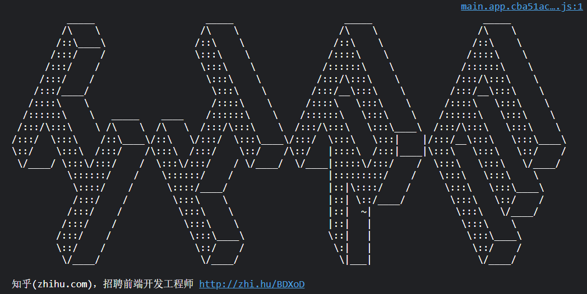

## 信息

一张图片

pronounce it

``<!-- peak hell sounds familiar ? -->``

求助网络，https://blog.csdn.net/jpch89/article/details/81369098 

发现：peak hell 连读起来就和 pickle 相近，而后者是python中一个内置库…………

所以指明工具是pickle，那么材料呢？

再看源码，有这么一句 ``<peakhell src="banner.p"> </peakhell> ``

这个src，暗示材料？将banner.p替换peak.html，得一堆字符…………

放在文件page_source.txt中。

## pickle

https://docs.python.org/3/library/pickle.html

pickle提供了一个简单的持久化功能。可以将对象以文件的形式存放在磁盘上。

pickle模块只能在python中使用，python中几乎所有的数据类型（列表，字典，集合，类等）都可以用pickle来序列化，

pickle序列化后的数据，可读性差，人一般无法识别。

`pickle.load(file)` 可将一个pickle序列对象加载成python对象

## 初次尝试

```
import pickle

with open('page_source.pickle', 'rb') as f:
    obj = pickle.load(f)
    print(obj)
```

注意这里要用rb方式打开二进制文本，同时文件存储成.pkl，这是pickle的后缀名

报错，`_pickle.UnpicklingError: the STRING opcode argument must be quoted`

根据解释：https://blog.csdn.net/palpiter/article/details/118862034
有可能是文件的问题，在复制时把一些\n之类的加入了里面。

所以不要手动复制，直接用urllib

```
import pickle
from urllib import request

url = r'http://www.pythonchallenge.com/pc/def/banner.p'

with request.urlopen(url) as f:
    obj = pickle.load(f)
    print(obj)
```

输出结果见 result.pdf

这是一堆元组，貌似还是一个二维数组，调整格式看一下

果真如此，有23行，每行有95个字符，那么，有' '和'#'两种字符，二维矩阵，想到了知乎的小彩蛋：



是不是这样的图案？

果真……

```
import pickle
from urllib import request

url = r'http://www.pythonchallenge.com/pc/def/banner.p'

with request.urlopen(url) as f:
    obj = pickle.load(f)

for line in obj:
    for colum in line:
        print(colum[0]*colum[1], end='')
    print()
```

真正的输出文件是real_result.pdf

结果是 channel

## 官方

http://wiki.pythonchallenge.com/level5


