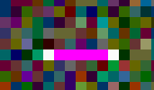

## 信息

网页标题`let me get this straight`

一张图片.

把它变直是什么意思。

## 初步尝试

图片中，有很多这样的小段。看一下其像素数值，发现是`249 195 195 195
 195 195 252`，即5个195并排。



所以是将它排成一条直线吗？

尝试一下，显然不是

排成直线，尝试一下将其左侧像素推到右边，左边都是195的条，尝试成功

得到图片，上有字母`romance`

```
from PIL import Image
import numpy as np

with Image.open('mozart.gif') as img:
    m, n = img.size
    data = np.asarray(img.getdata()).reshape([n, m])
    for i in range(n):
        inx = np.argwhere(data[i] == 195)[0][0]
        data[i] = np.concatenate((data[i][inx:], data[i][:inx]))
    new_img = Image.fromarray(data)
    new_img.save('result.gif', 'gif')
```

## 方法总结

```
with Image.open('mozart.gif') as img:
    m, n = img.size
    data = np.asarray(img.getdata()).reshape([n, m])
```

将图片读入并转成np

`np.argwhere(condition)`找满足condition的元素的索引

`np.concatenate((data[i][inx:], data[i][:inx]))`数据拼接，类似于排序

## 官方

http://www.pythonchallenge.com/pcc/return/romance.html

